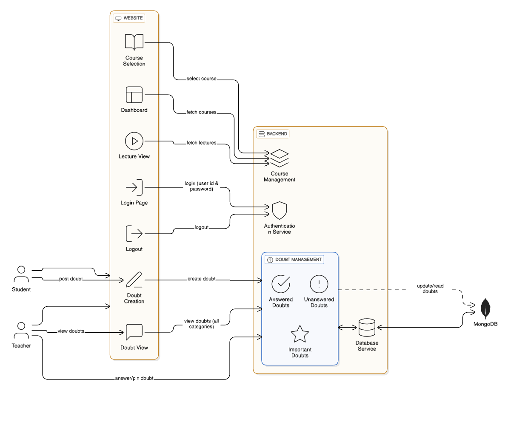

# SSD MidSem

A full-stack web application that provides a platform for managing courses, lectures, and user interactions.  
The project is split into a **backend (Node.js + Express + MongoDB)** and a **frontend (React + Vite)**.

---

## 📂 Project Structure

```
SSD_MidSem-feat-lecture-page/
│
├─ backend/          # REST API
│   ├─ server.js     # Express server entry point
│   ├─ db.js         # MongoDB connection
│   ├─ controllers/  # Business logic (course, user)
│   ├─ models/       # Mongoose schemas (User, Courses, Lectures, Questions)
│   └─ routes/       # API endpoints
|   └─ .env          # Environment Variables
│
└─ frontend/         # Client-side React app
    ├─ src/
    │   ├─ components/   # Reusable UI components
    │   ├─ App.jsx       # App root component
    │   └─ store.js      # State management (if needed)
    └─ index.html
```
## Note: We have not added .env files in repo as well as submission
To run the backend please create a .env file in backend directory and add 3 variables **PORT , MONGO_URI , JWT_SECRET**

## ⚡ Workflow

### 1️⃣ Backend (API)

1. **Server Setup**:

   - `server.js` creates an Express server and connects to MongoDB (`db.js`).
   - Middleware (e.g., `authMiddleware.js`) handles authentication.

2. **Routing**:

   - `routes/userRoute.js` handles user registration/login.
   - `routes/courseRoute.js` manages courses, lectures, and related questions.

3. **Controllers & Models**:
   - Controllers (`controllers/`) implement business logic.
   - Models (`models/`) define MongoDB schemas for Users, Courses, Lectures, and Questions.

---

### 2️⃣ Frontend (React + Vite)

1. **React App**:

   - `App.jsx` defines the main UI and routing.
   - `components/` contains UI elements such as cards and action buttons.

2. **State & Data**:

   - `store.js` manages global state if needed.
   - API requests fetch and post data to the backend.

3. **Build & Dev**:
   - Vite provides fast development server and optimized builds.

---

## 🛠️ Setup & Run

### Prerequisites

- [Node.js](https://nodejs.org/) (v16+ recommended)
- [MongoDB](https://www.mongodb.com/) instance (local or Atlas)

### Backend

```bash
cd backend
npm install
npm start       # or: node server.js
```

> Configure your MongoDB connection inside **backend/db.js** or via environment variables.

### Frontend

```bash
cd frontend
npm install
npm run dev     # Start Vite dev server
```

The frontend will run on [http://localhost:5173](http://localhost:5173) by default and communicate with the backend API.

---

## 🌐 Typical Flow

1. **User** signs up or logs in from the frontend.
2. **Frontend** sends API requests to the backend.
3. **Backend** validates, processes, and queries MongoDB.
4. Responses are sent back to the frontend to update the UI.

---

## 🖼️ System Architecture

The diagram below illustrates the overall workflow of the website, backend, and database:



## 📜 License

This project is for educational purposes (SSD MidSem).  
Use and modify freely for learning.

## GitHub Repo Link

https://github.com/aayush18602/SSD_MidSem/tree/kavan1
