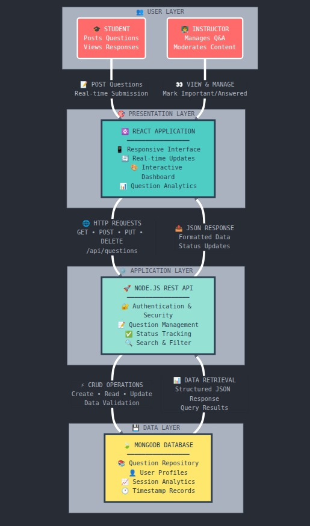

# VidyaVichara: Interactive Classroom Q\&A Board

**VidyaVichara** is an interactive, real-time classroom Q\&A application designed to allow students to post questions (as "sticky notes") during lectures and enable instructors to manage, filter, and answer them efficiently.

The project is built on the **MERN stack (MongoDB, Express, React, Node.js)** and utilizes **Socket.IO** for real-time bidirectional communication.

-----


HOSTED LINK: https://vidyavichar.gokulc.cloudns.ph


## 💻 Project Structure

```
.
├── backend/
│   ├── src/
│   │   ├── controllers/      # Business logic for Student and Teacher
│   │   ├── db/               # MongoDB connection setup
│   │   ├── models/           # Mongoose schemas (Student, Teacher, Class, Query)
│   │   ├── routes/           # Express API route definitions
│   │   ├── utils/            # Custom utility classes (ApiError, ApiResponse, asyncHandler)
│   │   ├── app.js            # Express app, middleware, and Socket.IO server initialization
│   │   └── index.js          # Entry point, DB connection, and server start
│   └── package.json
└── frontend/
    ├── src/
    │   ├── components/       # Reusable React components (Header, Forms, Cards)
    │   ├── pages/            # Main application pages (Login, Dashboard, Classroom)
    │   ├── services/         # API interaction logic (authService, classService, etc.)
    │   ├── store/            # Redux Toolkit setup
    │   └── App.jsx           # Main routing component
    └── vite.config.js        # Frontend configuration
```

-----

## 🛠️ Backend Documentation (Express/Node.js/Socket.IO)

The backend is built with Express.js and communicates with MongoDB via Mongoose. It features JWT-based authentication and uses Socket.IO for real-time updates.

### Setup and Running

1.  Navigate to the `backend/` directory.

2.  Install dependencies: `npm install`

3.  Create a `.env` file in `backend/src/` with the following variables:

    ```env
    PORT=8000
    MONGODB_URI=YOUR_MONGODB_URL
    CORS_ORIGIN=http://localhost:5173
    ACCESS_TOKEN_SECRET=YOUR_ACCESS_SECRET
    ACCESS_TOKEN_EXPIRY=1d
    REFRESH_TOKEN_SECRET=YOUR_REFRESH_SECRET
    REFRESH_TOKEN_EXPIRY=10d
    ```

4.  Start the server in development mode:

    ```bash
    npm run dev
    ```

## ⚙️ Frontend Environment Variables

To configure environment variables for the frontend (React/Vite):

1. **Create a file named `.env` inside the `frontend` directory.**
2. **Add the following line to specify the Socket.IO server URL:**

  ```env
  VITE_SOCKET_URL=http://localhost:8000
  ```

Replace the URL if your backend runs elsewhere. This variable is used by the frontend to connect to the backend's Socket.IO server.


### Database Models

| Model | File | Key Fields | Roles |
| :--- | :--- | :--- | :--- |
| **Student** | `student.model.js` | `Name`, `email`, `Roll_Number` (unique), `password`, `activeClass` (ref to Class) | Student |
| **Teacher** | `teacher.model.js` | `Name`, `email`, `password` | Teacher |
| **Class** | `class.model.js` | `title`, `teacher` (ref to Teacher), `accessCode`, `status` (enum: 'active', 'notActive') | Both |
| **Query** | `query.model.js` | `student` (ref), `class` (ref), `queryText`, `status` (enum: 'Unanswered', 'Answered'), `isImportant` | Both |

### Key API Endpoints

The API is prefixed with `/api/v1`.

| Role | Route | Method | Description |
| :--- | :--- | :--- | :--- |
| **Auth** | `/student/register` | POST | Register a new student |
| **Auth** | `/teacher/login` | POST | Log in a teacher |
| **Teacher** | `/teacher/createClass` | POST | Create a new class with an auto-generated access code |
| **Teacher** | `/teacher/getAllClassQueries` | GET | Fetch all queries for a specific class |
| **Teacher** | `/teacher/answerQuery` | POST | Mark a query as 'Answered' or 'Unanswered' (triggers Socket.IO update) |
| **Teacher** | `/teacher/endClass` | POST | Set class status to 'notActive' and clear students' `activeClass` field (triggers Socket.IO `classEnded` event) |
| **Student** | `/student/getAllActiveClasses` | GET | Fetch a list of all active classes |
| **Student** | `/student/joinClass` | POST | Join a class using its access code, sets `activeClass` on the student's record |
| **Student** | `/student/createQuery` | POST | Post a new question (triggers Socket.IO update) |

### Real-time Communication (Socket.IO)

The application uses Socket.IO for real-time updates in the classroom.

| Event | Direction | Triggered By | Functionality |
| :--- | :--- | :--- | :--- |
| `joinClassroom` | FE → BE | `ClassroomPage.jsx` mount | Server joins the socket client to the room named after the `classId`. |
| `queryUpdate` | BE → FE | `createQuery`, `answerQuery`, `impQuery` successful API calls | Notifies all clients in the classroom room to **re-fetch** the questions list. |
| `classEnded` | BE → FE | `endClass` successful API call | Forces connected clients to leave the room and redirects them to the dashboard. |

-----

## 🌐 Frontend Documentation (React/Vite)

The frontend is a single-page application (SPA) built with React and Vite, using Redux Toolkit for state management and styled primarily with custom CSS classes.

### Setup and Running

1.  Navigate to the `frontend/` directory.
2.  Install dependencies: `npm install`
3.  Ensure the backend is running on **port 8000**.
4.  Start the development server:
    ```bash
    npm run dev
    npm install react-redux react-router-dom @reduxjs/toolkit
    ```
    The application will run on **port 5174**.

### Configuration

  * **Vite Proxy:** The application is configured to proxy all `/api` requests to the backend server running at `http://localhost:8000`.

    ```javascript
    // vite.config.js excerpt
    proxy: {
      '/api': {
        target: 'http://localhost:8000',
        changeOrigin: true,
        secure: false
      }
    }
    ```

  * **API Service:** The base Axios instance is set up in `frontend/src/services/api.js` to automatically include the `Authorization: Bearer <token>` header from `localStorage` on requests, and to handle unauthenticated responses by redirecting to `/login`.

### State Management

  * **Redux/Redux-Persist:** The global state is managed using **Redux Toolkit** and is persisted across sessions using `redux-persist` to save the `auth` slice to local storage.
  * **`authSlice.js`:** This slice manages user authentication status (`isAuthenticated`), user data (`user`), loading state, and includes the critical `setActiveClass` reducer used when a student successfully joins a class.

### Core Pages & Components

| Page/Component | File | Role |
| :--- | :--- | :--- |
| **App Router** | `App.jsx` | Defines routes (`/`, `/login`, `/signup`, `/dashboard`, `/classroom/:classId`) and wraps authenticated routes with `<ProtectedRoute>`. |
| **DashboardPage** | `DashboardPage.jsx` | Fetches and displays classes. Contains logic for a teacher to **create a class** (`<CreateClassModal>`) and for a student to **join a class** (`<JoinClassModal>`) using an access code. |
| **ClassroomPage** | `ClassroomPage.jsx` | The core real-time view. Contains logic for the **Socket.IO client connection** and listeners. Handles fetching and filtering of questions and rendering the `QuestionBoard`. |
| **StickyNote** | `StickyNote.jsx` | Displays a single question. Includes conditional action buttons (Mark Answered, Toggle Important) visible only to the teacher. |
| **FilterControls** | `FilterControls.jsx` | Used by the teacher in the classroom to filter questions by 'All', 'Unanswered', 'Answered', and 'Important'. |

### Authentication Roles

  * The **Signup** and **Login** pages use a role selector to differentiate between Student and Teacher accounts, ensuring the correct authentication API is called.
  * The `ProtectedRoute` component ensures that non-authenticated users are redirected to `/login`.

### Assumptions ###
1. Strict Two-Role System: The application only supports two distinct user roles, Student and Teacher, with separate registration, login, and authorization logic for each.

2. Socket.IO for All Real-time: All real-time interactivity (new questions, status updates, class ending) is handled exclusively by Socket.IO signals, which trigger a data re-fetch on the client side.

3. One Active Class Per Student: A student can be actively participating in only one class at a time, tracked by the activeClass field in the Student model. Access to a classroom requires this field to be set.

4. JWT via HTTP-Only Cookies: Authentication is managed using JSON Web Tokens (JWTs) transported securely primarily via HTTP-only cookies for better security against XSS attacks.

5. Simplified Question Status: Questions (Queries) only track a binary status: 'Unanswered' (default) or 'Answered', along with an optional isImportant boolean flag.

6. Persistent Deletion for Clearing: The "Clear Board" functionality, triggered by the teacher, is assumed to perform a permanent, irreversible deletion of all questions for the specified class from the MongoDB database 





### Github Repo
```https://github.com/sumitgk2003/VidyaVichar_SSD_M25_G20```

-----

