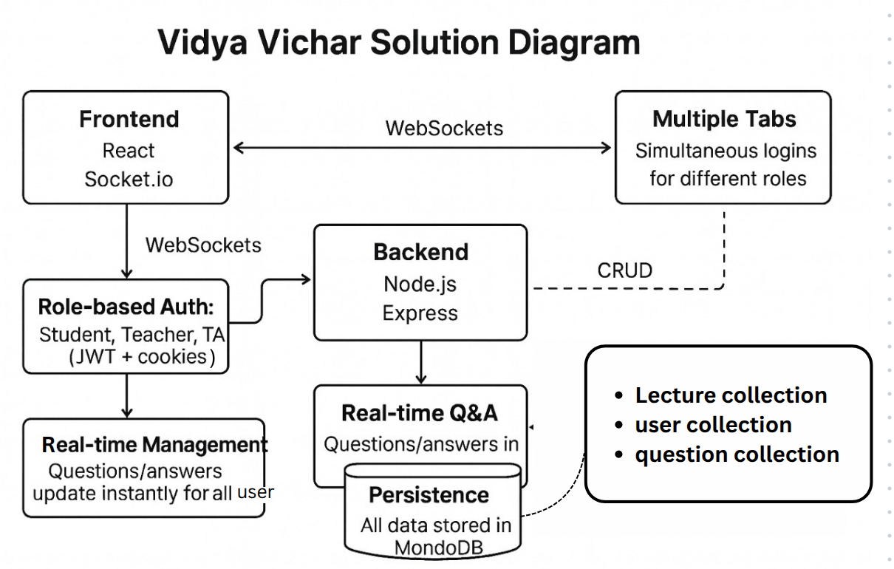

# SSD_MID_group_21: VidyaVichar Application

## Overview


VidyaVichar is a classroom Q&A sticky board where students can post questions in real-time during lectures. Questions appear as colorful sticky notes that
instructors can view, mark, and organize. The system must be built using the MERN stack,
where React handles the interactive frontend, Express + Node.js manages the backend
logic, and MongoDB stores all questions, statuses, and timestamps. This ensures
questions are persistently saved, retrievable across sessions, and available for later review
and analytics.

---

## Solution Diagram


## Folder Structure

```
SSD_MID_group_21/
├── backend/
│   ├── src/
│   │   ├── controllers/
│   │   ├── middleware/
│   │   ├── models/
│   │   ├── routes/
│   │   ├── seed.js
│   │   ├── server.js
│   │   └── socket.js
│   ├── .env.example
│   └── package.json
└── frontend/
    ├── public/
    ├── src/
    │   ├── pages/
    │   |   ├── InstructorView.js
    |   │   ├── Login.js
    |   │   ├── StudentView.js
    |   │   ├── TAView.js
    │   ├── services/
    |   │   ├── api.js
    │   ├── App.js
    │   └── index.js
    └── package.json
```

---

## Setup Instructions

### Prerequisites
- Node.js (v20+ recommended)
- npm 
- MongoDB (local or Atlas)

### 1. Clone the Repository
```bash
git clone https://github.com/Yogesh-Narasimha/SSD_MID_group_21.git
cd SSD_MID_group_21
```
### 2. Mongodb Setup
```bash
mongod     # to start mongodb locally
```

### 3. Backend Setup
```bash
cd backend
npm install
npm run dev             # Starts the backend server
```

### 4. Frontend Setup
```bash
cd ../frontend
npm install
npm start              # Starts the React app on http://localhost:3000
```

### Note :

open the "localhost:3000" in two different browsers for Role based access. For example:
- chrome and firefox
- chrome and ms edge

chrome and chrome should not be used in this case.

---

## Implementation Details

### Backend (Node.js, Express, MongoDB)
- **Authentication:** JWT-based, with middleware for protected routes.
- **Models:** User, Lecture, Question (Mongoose schemas).
- **Controllers:** Handle logic for auth, lectures, and questions.
- **Socket.io:** Enables real-time Q&A and updates between users.
- **REST API:** CRUD endpoints for lectures, questions, and user management.

### Frontend (React)
- **Pages:** Separate views for Instructor, Student, TA, and Login.
- **Services:** API abstraction for backend communication.
- **State Management:** React hooks and context for user/session state.
- **WebSocket Integration:** Real-time updates for Q&A and lecture events.

---

## Design Decisions

- **MERN Stack:** Chosen for react and a unified JavaScript codebase.
- **Socket.io:** Used for real-time features (Q&A, live updates) to enhance interactivity.
- **Role-based Access:** Different UI and permissions for Instructors, Students, and TAs.
- **Separation of Concerns:** Clear separation between API logic, roles logic, and data models.
- **.env Configuration:** Sensitive data and environment-specific settings are managed via environment variables.

---

## Solution Diagram



## Authors

- Chandrakanth Reddy
- Piyush Aggarwal
- Madha Manish
- Yogesh Rachaputi
- Hritik Ranjan

---

