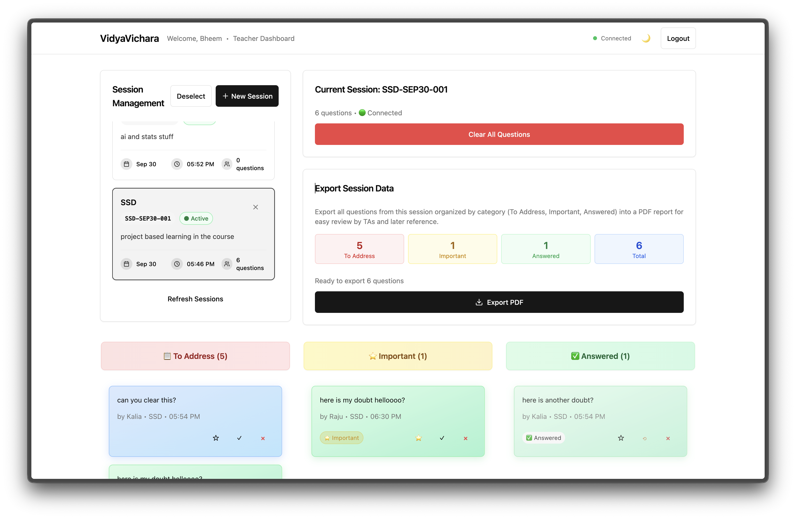
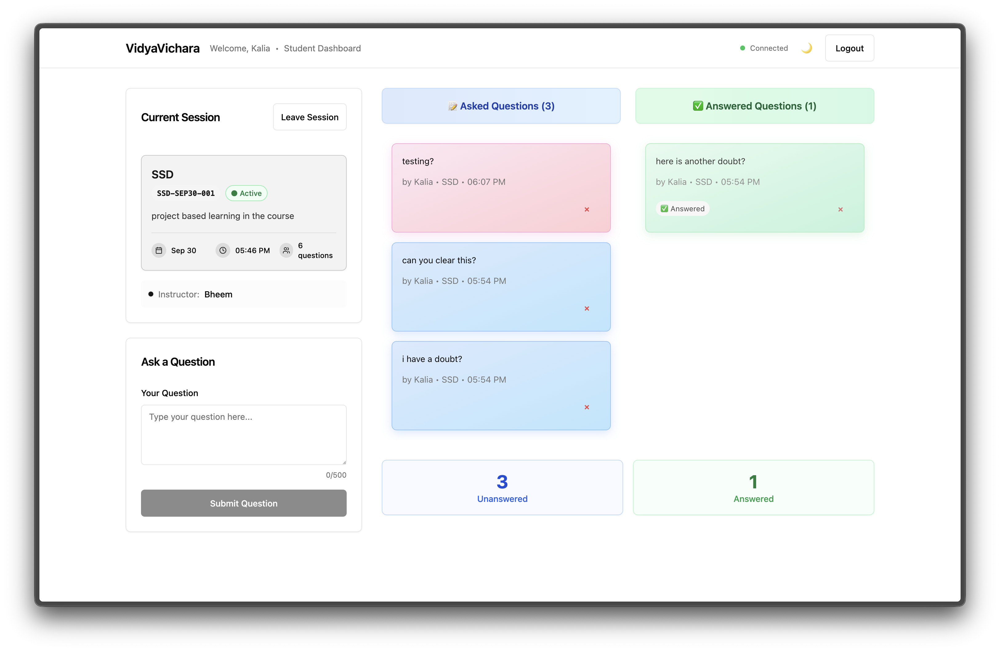
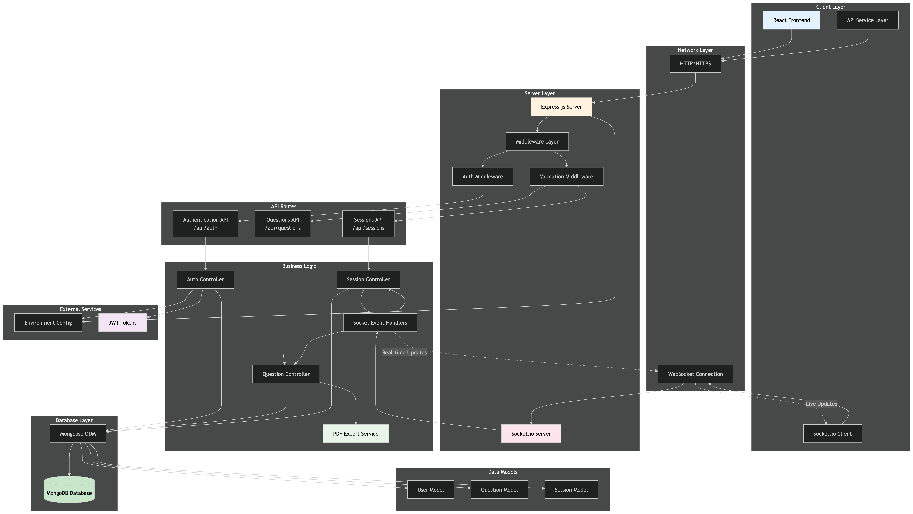
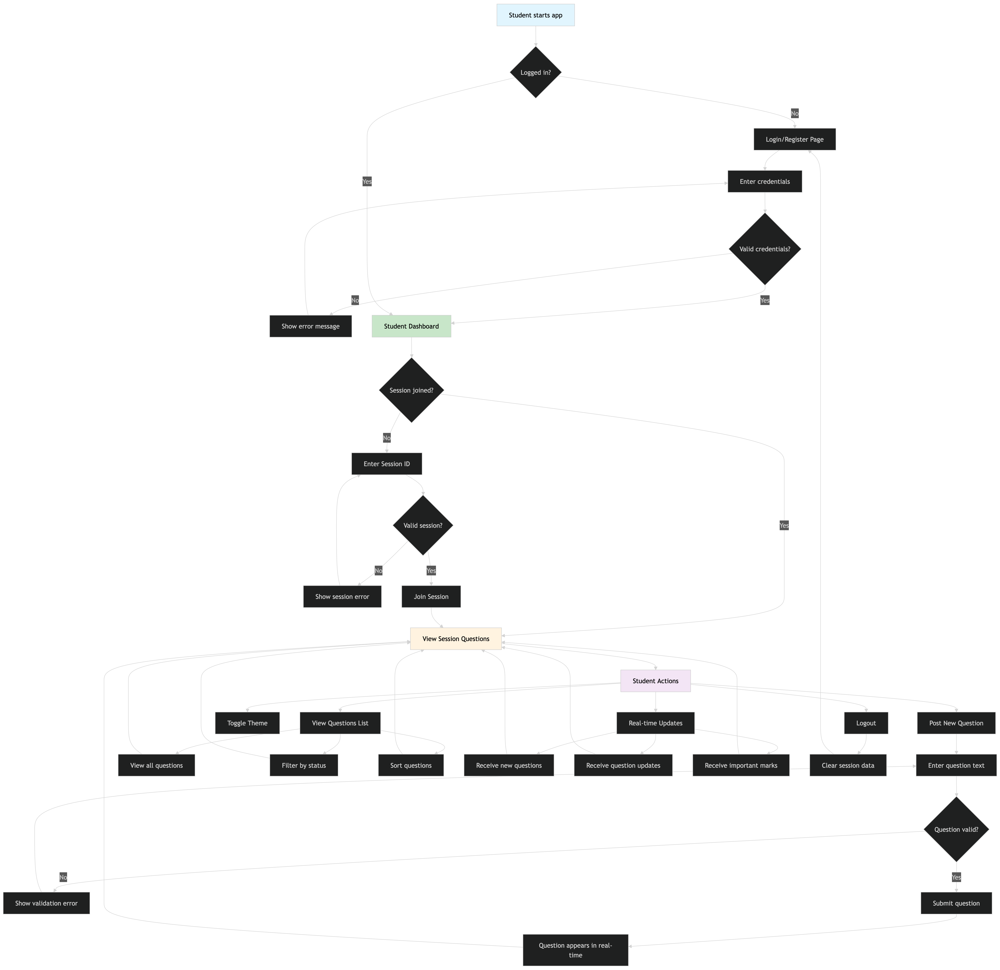

# VidyaVichara - Classroom Q&A Board

> Github Link is [here](https://github.com/abhinavborah/vidyavichara-team25)

A real-time classroom Q&A application where students can post questions during lectures and instructors can view, organize, and respond to them in real-time.

Made with ❤️ by Team 25.

## Teacher's Dashboard



## Student's Dashboard



---

## Features

- **Real-time Q&A**: Students post questions instantly, teachers see them live
- **Session Management**: Teachers create and manage lecture sessions with human-readable IDs
- **Role-based Access**: Separate dashboards for students and teachers
- **Question Management**: Mark questions as important, answered, or delete them
- **PDF Export**: Teachers can export session summaries as PDF reports
- **Session Control**: Teachers can end sessions and clear questions
- **Real-time Updates**: Socket.io for instant synchronization across all users
- **Responsive Design**: Works seamlessly on mobile, tablet, and desktop
- **Dark/Light Theme**: Toggle between themes with ☀️/🌙 button

## 🛠️ MERN Stack Implementation

### Frontend (React + Vite)

- **React 18**: Modern functional components with hooks
- **Vite 5**: Fast development server with HMR and optimized builds
- **Tailwind CSS**: Utility-first CSS framework for rapid UI development
- **shadcn/ui**: High-quality component library built on Radix UI primitives
- **Socket.io Client**: Real-time bidirectional communication
- **React Router DOM**: Client-side routing and navigation
- **Zod**: Runtime type validation for forms and API responses

### Backend (Express + Node.js)

- **Express 4**: Minimal and flexible Node.js web framework
- **Socket.io 4**: Real-time engine with WebSocket fallback
- **Mongoose**: MongoDB object modeling for Node.js
- **JWT**: Stateless authentication with JSON Web Tokens
- **bcryptjs**: Password hashing with salt rounds
- **Helmet**: Security middleware for HTTP headers
- **CORS**: Cross-origin resource sharing configuration

### Database (MongoDB)

- **MongoDB 6+**: Document-oriented NoSQL database
- **Mongoose ODM**: Object document mapping with schema validation
- **Indexing**: Optimized queries for session and user data
- **Aggregation**: Complex queries for analytics and reporting

## 🎨 Design Decisions

### Architecture Patterns

- **RESTful API**: Clean separation between frontend and backend
- **Real-time Communication**: Socket.io for instant updates across clients
- **JWT Authentication**: Stateless auth for scalability
- **Component-based UI**: Reusable React components for maintainability

### Technical Choices

- **Human-readable Session IDs**: Format like `SCI-SEP26-001` for easy sharing
- **Role-based Authorization**: Middleware-based permissions (student/teacher)
- **Responsive Design**: Mobile-first approach with Tailwind breakpoints
- **Dark/Light Theme**: CSS variables with system preference detection
- **Error Boundaries**: Graceful error handling in React components
- **Input Validation**: Client-side and server-side validation with Zod

### Performance Optimizations

- **Socket.io Rooms**: Efficient real-time updates per session
- **Database Indexing**: Optimized queries for session and user lookups
- **Code Splitting**: Lazy loading with React.lazy and Suspense
- **Bundle Optimization**: Vite's automatic code splitting and tree shaking

## 🏗️ Architecture

- **Frontend**: React 18 + Vite 5 + Tailwind CSS + shadcn/ui
- **Backend**: Express 4 + Node.js 18+ + Socket.io 4
- **Database**: MongoDB 6+ with Mongoose ODM
- **Authentication**: JWT tokens with bcrypt password hashing
- **Validation**: Zod schemas for type-safe API contracts
- **Styling**: Mobile-first responsive design with CSS variables for theming

---

## How to get the project running (setup guide)

### 1. Clone and Install

```bash
# Install backend dependencies
cd backend
npm install

# Install frontend dependencies
cd ../frontend  
npm install
```

### 2. Environment Setup

**Backend Environment:**

```bash
cd backend
cp .env.example .env
# Edit .env with your MongoDB URI and JWT secret
```

**Frontend Environment:**

```bash
cd frontend
cp .env.example .env
# Edit .env if needed (defaults should work for local development)
```

### 3. Database Setup

Start MongoDB locally or ensure your MongoDB Atlas connection is ready. The application will automatically create the required collections.

```bash
# mongosh mongodb://localhost:27017/vidyavichara
```

### 4. Start the Application

**Start Backend (Terminal 1):**

```bash
cd backend
npm run dev
# Backend runs on http://localhost:3001
```

**Start Frontend (Terminal 2):**

```bash
cd frontend  
npm run dev
# Frontend runs on http://localhost:5173
```

### 5. Use the Application

1. Open <http://localhost:5173> in your browser
2. Register as either a Student or Teacher
3. **Students**: Submit questions for your lecture session
4. **Teachers**: Load a session to view and manage questions in real-time

## Solution Diagram



## User Flows

### Teacher


### Student



# VidyaVichara System Assumptions

## User Management & Authentication

1. **One session can only be taught by a single teacher** - Each session has exactly one `createdBy` field linking to a single teacher
2. **Users can only have one role** - A user is either a 'student' or 'teacher', not both
3. **Email addresses are unique** - One email per user account across the entire system
4. **Users remain active by default** - New users have `isActive: true` and can only be deactivated, not deleted
5. **JWT tokens are stateless** - No server-side session storage; tokens contain all necessary auth info
6. **Token expiration is fixed** - Default 7-day expiration for all users regardless of role
7. **Password requirements are uniform** - Minimum 8 characters for all users
8. **Only active users can log in** - Inactive users are blocked from authentication

## Session Management

9. **Session IDs are auto-generated** - Human-readable format: `COURSE-MMMDD-XXX` (e.g., `SCI-SEP26-001`)
10. **Sessions are owned by their creator** - Only the teacher who created a session can modify/end it
11. **Sessions can be created for future dates** - No restriction on session date being today or future
12. **Session names are limited to 50 characters** - Course name constraint for ID generation
13. **Sessions persist indefinitely** - No automatic cleanup of old sessions
14. **Sessions are single-day events** - No multi-day session support in the ID generation logic
15. **Only teachers can create sessions** - Students cannot initiate new lecture sessions
16. **Sessions can be inactive but not deleted** - Soft delete approach using `isActive` flag
17. **Session sequence numbers are auto-incremented** - Multiple sessions per course/date get sequential numbers

## Question Management

18. **Students can ask multiple questions per session** - No limit on question count per student
19. **Duplicate questions are prevented per user per session** - Same user cannot ask identical question text in same session
20. **Questions are limited to 500 characters** - Hard limit on question text length
21. **Questions are automatically colored** - Random pastel color assignment on creation
22. **Questions persist after session ends** - Questions remain accessible even when session is inactive
23. **Question authors cannot be changed** - `author` field is immutable after creation
24. **Questions can be reordered by display order only by teacher** - Only teachers can change display order, students are not allowed
25. **Question status is tri-state** - 'unanswered', 'answered', or 'important' only
26. **Only teachers can update question status** - Students cannot mark their own questions as answered
27. **Questions use soft delete** - `isActive: false` instead of actual deletion
28. **Questions store metadata** - IP address and user agent tracked for each question

## Real-time Communication

29. **Socket connections are session-scoped** - Users join/leave specific session rooms
30. **Real-time updates are immediate** - No batching or throttling of socket events
31. **Socket authentication uses JWT** - Same token system as REST API
32. **Disconnections are handled gracefully** - Automatic reconnection with exponential backoff
33. **Socket events are unidirectional** - Server broadcasts, clients receive (no peer-to-peer)

## Authorization & Permissions

34. **Teachers have elevated privileges** - Can modify any question status, clear sessions, etc.
35. **Students can not modify their own questions**
36. **Session ownership is absolute** - Only session creator can perform admin actions
37. **Role-based access is enforced on all endpoints** - No role escalation possible
38. **API endpoints require authentication** - No anonymous access to any functionality

## Data Persistence & Storage

39. **MongoDB is the single source of truth** - No caching layer or secondary storage
40. **Relationships use ObjectId references** - Foreign keys link documents across collections
41. **Pre-population is automatic** - Author/creator details auto-populated on queries
42. **Indexes are manually defined** - No automatic index generation beyond unique constraints
43. **Data validation happens at both schema and application level** - Mongoose + Zod validation
44. **Timestamps are automatically managed** - `createdAt` and `updatedAt` fields auto-generated

## Client-side Behavior

45. **Session selection persists in browser** - `sessionStorage` remembers selected session ID
46. **Authentication state is localStorage-based** - JWT token stored in browser local storage
47. **Real-time connection is mandatory** - Application expects socket connection for full functionality
48. **PDF export is client-side generated** - No server-side PDF generation
49. **Theme preference is persisted** - Dark/light mode setting saved locally
50. **Form validation mirrors server validation** - Client-side validation matches backend schemas
