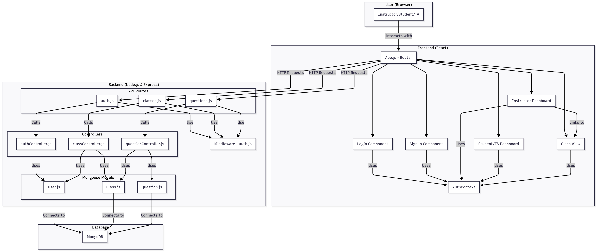

# VidyaVichara

VidyaVichara is an interactive classroom Q\&A system that connects instructors and students in real-time. This repository contains both the frontend and backend source code for the application.



### Github link: 
https://github.com/Ishaan-Giri/VidyaVichar.git

-----

# 📚 VidyaVichara Backend

> The backend for **VidyaVichara**, an interactive classroom Q\&A system.

This backend provides the API for the VidyaVichara application. It handles user authentication, class creation and management, and real-time question and answer functionality.

-----

## 📁 Directory Structure

```
backend/
├── package-lock.json
├── package.json
├── server.js
├── controllers/
│   ├── authController.js
│   ├── classController.js
│   └── questionController.js
├── middleware/
│   └── auth.js
├── models/
│   ├── Class.js
│   ├── Question.js
│   └── User.js
├── routes/
│   ├── auth.js
│   ├── classes.js
│   └── questions.js
└── utils/
    ├── errorHandler.js
    └── generateAccessCode.js
```

-----

## 📄 File Overview

### Root

  * **`server.js`** – The main entry point for the backend application. It sets up the Express server, connects to MongoDB, and configures middleware and routes.
  * **`package.json`** – Lists the project's dependencies and scripts.

### `controllers/`

  * **`authController.js`** – Handles user registration and login.
  * **`classController.js`** – Manages the creation, joining, and retrieval of classes.
  * **`questionController.js`** – Manages the creation and retrieval of questions.

### `middleware/`

  * **`auth.js`** – JWT middleware to protect routes.

### `models/`

  * **`Class.js`** – Mongoose schema for classes.
  * **`Question.js`** – Mongoose schema for questions.
  * **`User.js`** – Mongoose schema for users.

### `routes/`

  * **`auth.js`** – Routes for user authentication.
  * **`classes.js`** – Routes for class management.
  * **`questions.js`** – Routes for question management.

### `utils/`

  * **`errorHandler.js`** – Custom error handling middleware.
  * **`generateAccessCode.js`** – Utility to generate a random, six-character access code for classes.

-----

## 🚀 Running the Backend

1.  **Clone the repo** and navigate to the `backend` folder.
2.  **Install dependencies**:
    ```bash
    npm install
    ```
3.  **Create a `.env` file** and add your MongoDB connection string and a JWT secret:
    ```envConfigure environment variables.

    Create a .env file in the root:

    PORT=your_port_number
    MONGODB_URI=your_mongodb_connection_string
    JWT_SECRET=your_jwt_secret
    ```
4.  **Start the server**:
    ```bash
    npm run dev
    ```
5.  The server will start on port 5000, or the port specified in your `.env` file.

-----

# 📚 VidyaVichara Frontend

> An interactive classroom Q\&A system that connects instructors and students in real-time

This is the frontend for **VidyaVichara**, an interactive classroom Q\&A system. Instructors can create virtual classrooms, and students can join with an access code. Students can post questions (anonymously or with their names), which appear on a shared dashboard in real time.

-----

## 📁 Directory Structure

```
frontend/
├── .env
├── package-lock.json
├── package.json
├── public/
│   ├── index.html
│   └── manifest.json
└── src/
    ├── App.css
    ├── app.js
    ├── index.css
    ├── index.js
    ├── reportWebVitals.js
    ├── setupTests.js
    ├── components/
    │   ├── CreateClass.js
    │   ├── InstructorDashboard.js
    │   ├── Login.js
    │   ├── QuestionFilter.js
    │   ├── Signup.js
    │   ├── StickyNote.js
    │   └── StudentDashboard.js
    ├── context/
    │   └── AuthContext.js
    ├── hooks/
    │   └── usePolling.js
    └── utils/
        ├── api.js
        ├── constants.js
        └── helpers.js
```

-----

## 📄 File Overview

### `public/`

  * **`index.html`** – Main HTML entry point. React mounts here.
  * **`manifest.json`** – Metadata (name, icons, theme).

### `src/`

  * **`index.js`** – App entry point, renders `App`.
  * **`app.js`** – Sets up routes and auth provider.
  * **`App.css`, `index.css`** – Global styles.
 

#### 🧩 Components

  * **`Login.js`** – Login form (instructor with credentials, student with access code).
  * **`Signup.js`** – Instructor signup form.
  * **`InstructorDashboard.js`** – Instructor view. Create classes, manage questions.
  * **`StudentDashboard.js`** – Student view. Shows questions and allows posting.
  * **`CreateClass.js`** – Form to create new class sessions.
  * **`StickyNote.js`** – Displays a single question card.
  * **`QuestionFilter.js`** – Filters questions by status.
  * **`ClassView.js`** - This component renders the view for a specific class, displaying the questions and allowing the instructor to manage them.

#### 🔐 Context

  * **`AuthContext.js`** – Handles login, signup, logout. Provides user auth state.

#### 🎣 Hooks

  * **`usePolling.js`** – Custom polling hook for real-time updates.

#### 🛠️ Utils

  * **`api.js`** – Axios instance for API calls.
  * **`constants.js`** – Shared constants (endpoints, colors, etc.).
  * **`helpers.js`** – Helper functions (time formatting, validation).

-----

## 🚀 Running the App

1.  **Clone the repo** and go to the `frontend` folder.

2.  **Install dependencies:**

    ```bash
    npm install
    npm i react-router-dom
    npm i axios
    ```

3.  **Create a `.env` file** with your backend URL:

    ```env
    REACT_APP_API_URL=http://localhost:5000/api
    Change the port number here with your port number in backend
    ```

4.  **Start the dev server:**

    ```bash
    npm start
    ```

5.  **Open your browser** to [http://localhost:3000](https://www.google.com/search?q=http://localhost:3000)


### 🔐 Authentication (`/api/auth`)

| Method | Endpoint | Description | Authorization |
|--------|----------|-------------|---------------|
| `POST` | `/signup` | Register a new user | - |
| `POST` | `/login` | Login with email & password | - |
| `GET` | `/me` | Get logged-in user details | JWT Required |

### 🏫 Classes (`/api/classes`)

| Method | Endpoint | Description | Authorization |
|--------|----------|-------------|---------------|
| `POST` | `/create` | Create a new class | Instructor only, JWT Required |
| `GET` | `/my-classes` | Get classes created by the logged-in instructor | JWT Required |
| `POST` | `/join` | Join a class using access code | - |
| `GET` | `/:id` | Get class details by ID | - |
| `PATCH` | `/:classId/end` | End a class manually | Instructor only, JWT Required |

### ❓ Questions (`/api/questions`)

| Method | Endpoint | Description | Authorization |
|--------|----------|-------------|---------------|
| `POST` | `/post` | Post a question to a class | Student |
| `GET` | `/class/:classId` | Get all questions for a class | - |
| `GET` | `/for-class/:classId` | Get questions for a class for instructor review | JWT Required |
| `PATCH` | `/:questionId/status` | Update question status | Instructor only, JWT Required |
| `DELETE` | `/class/:classId/clear` | Clear all questions in a class | Instructor only, JWT Required |


## Assumptions

### Instructor-First Flow
- Instructors must **sign up** with:
  - Username
  - Password (minimum 6 characters)
  - Confirm password  
- Instructors must **log in** before creating or managing classes.
- Classes are created **at the time of need** and run only for the specified duration.
- Class duration has a **minimum of 5 minutes**.
- Each class is assigned a **unique random access code** generated by the backend.
- Instructors are responsible for sharing the **access code** with Students/TAs.
- Once instructor clears the board they won't be able to see the questions but students/TA can still access that.

### Access & Roles
- **Students/TAs** do not need signup; they join a class using the **access code**.
- Anyone with a valid access code (even after the class ends) can **view the history** of that class.

### Question Management
- **Instructors can**:
  - Mark questions as **answered**, **unanswered** or **important**
  - Once the board is cleared, the questions will move to **Archived** section but will be visible for the students and TA's.
  - **Clear the board** (removes questions from instructor’s view but not from students’ view)
  - **End the class** (blocks new questions from being posted and ends the timer)
- **Students/TAs can**:
  - Post questions **only while the class is active**
  - View real-time question statuses (**answered/important**)
  - View history and analytics(total question, answered count , unanswered count) after class ends (but cannot post new questions)


### Logout
- Both **Instructors** and **Students/TAs** have a logout option.

---

## Workflow

### Instructor Flow
1. **Signup → Login**
2. Dashboard shows:
   - **Create Class** button
   - **History of past classes**
3. **Create Class**  
   - Enter `classname` + `duration` (≥ 5 min)  
   - System generates **random access code**
4. Instructor shares access code with Students/TAs
5. Inside Class:
   - **View Questions** (opens live question feed)
   - Mark questions as **answered/important**
   - **Clear board** and **End class**
6. After class ends → see **analytics summary**
7. **Logout**

### Student/TA Flow
1. **Enter class** using access code
2. See **time remaining** for class
3. While class is active:
   - **Post questions**
   - no duplicate questions are allowed.
   - View question statuses (**answered/important**)
4. After class ends:
   - View **history of questions & statuses** (cannot post)
   - See **Class Ended** message
5. **Logout**

---
