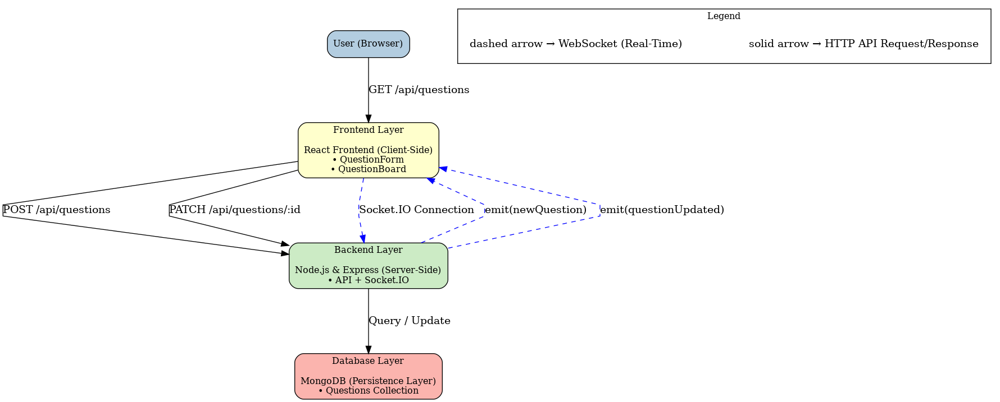

# VidyaVichar - Real-Time Classroom Q&A Board

VidyaVichar is an interactive classroom Q&A sticky board built for the SSD Mid-Semester Hackathon. It allows students to post questions in real-time during lectures, which appear as sticky notes on a themed blackboard interface. Instructors can dynamically manage these questions, ensuring an engaging and uninterrupted learning experience.

**Live Demo:** `https://vidyavichar-server.onrender.com`

---

## 🌟 Features

* **Real-Time Question Board:** New questions and updates appear instantly for all users without needing a page refresh, powered by Socket.IO.
* **Student Submissions:** A simple and intuitive form for students to post their name and question.
* **Instructor Controls:** Instructors can mark questions as "Answered" or "Important," which provides immediate visual feedback on the sticky notes.
* **Advanced Filtering:** The board can be filtered to show "All," "Unanswered," or "Important" questions.
* **Non-Destructive Board Clearing:** The "Clear Board" button archives all current questions for later review, rather than permanently deleting them.
* **Persistent Archive View:** A dedicated view allows instructors and TAs to review all past questions from previous sessions, fulfilling the "later review and analytics" requirement.
* **Themed Interface:** A fun and immersive blackboard theme with chalk-style text and a duster-style toolbar.

---

## 💻 MERN Implementation Details

This project is built using the MERN stack as per the requirements.

* **MongoDB:** A NoSQL database used for storing all question data. Hosted on MongoDB Atlas for production.
* **Express.js:** A backend web framework running on Node.js, used to build the REST API and manage the Socket.IO server.
* **React:** A frontend library used to build the interactive and responsive user interface. The project was bootstrapped with Vite for a fast development experience.
* **Node.js:** The JavaScript runtime environment for the server.

---

## 🏛️ Solution Diagram

This diagram illustrates the flow of data between the client, server, and database, highlighting both the standard REST API communication and the real-time WebSocket connection.


-----

## 🧠 Design Decisions

As per the prompt, we made several key architectural decisions:

1.  **Real-Time Implementation (Socket.IO):** To meet the "real-time" requirement, we chose Socket.IO over simple HTTP polling. Polling would involve the client repeatedly asking the server for updates, which is inefficient. Socket.IO creates a persistent, two-way connection, allowing the server to instantly "push" updates to all clients. This results in a smoother user experience and a more scalable backend.

2.  **Non-Destructive "Clear Board" (Archiving):** The prompt required questions to be "cleared" but also "available for later review." A simple `DELETE` operation would violate the second requirement. We solved this by adding an `isArchived` boolean field to our `Question` model. The "Clear Board" button now performs a `DELETE` operation on the backend that archives all active questions by setting this flag to `true`. The main board view fetches only non-archived questions, while a separate "Show Archive" button allows for the review of all past questions.

3.  **Stateless Backend & REST-ful API:** We designed our Express API to be stateless. The server does not store any session state about the user. All information is managed through the database, and the frontend is responsible for its own state. This adheres to REST principles and makes the application easier to scale.

4.  **Monorepo Structure (`/client`, `/server`):** We intentionally separated the frontend and backend code into their own directories within a single repository. This is a standard practice for MERN applications that keeps concerns separated, allows for independent dependency management (`package.json`), but simplifies project management and deployment.

5.  **Git Workflow:** We adopted a professional Git workflow using `develop`, `production`, and `main` branches. All features were developed on separate `feature` branches and submitted via Pull Requests. This ensured code was reviewed before integration and that our `main` branch always represented a stable, deployable state.

-----

## 📝 API Endpoints & Real-Time Events

### REST API

The core API endpoints for managing questions are:

| Method | Endpoint | Description |
|:---|:---|:---|
| `GET` | `/api/questions` | Fetches questions. Supports filtering via query params like `?status=unanswered` or `?isArchived=true`. |
| `POST` | `/api/questions` | Creates a new question. |
| `PATCH`| `/api/questions/:id` | Updates a question's `status` or `isImportant` flag. |
| `DELETE`| `/api/questions` | Archives all active questions on the board (non-destructive). |

### Real-Time Events (Socket.IO)

The server uses Socket.IO to push real-time updates to all connected clients.

| Event Name | Direction | Payload | Description |
|:---|:---|:---|:---|
| `newQuestion` | Server → Client | `Question Object` | Fired when a new question is submitted. |
| `questionUpdated` | Server → Client | `Question Object` | Fired when a question's status is updated. |
| `boardCleared` | Server → Client | `(None)` | Fired when the instructor clears the board. |

-----

## 🚀 Setup and Installation

Follow these instructions to run the project locally.

### Prerequisites

  * Node.js (v20.x or higher recommended)
  * npm
  * A local MongoDB instance or a MongoDB Atlas connection string

### 1\. Clone the Repository

```bash
git clone https://github.com/SSD-MidSem-Hackathon/VidhyaVichar.git
cd VidhyaVichar
```

### 2\. Set Up the Backend

```bash
# Navigate to the server directory
cd server

# Install dependencies
npm install

# Create a .env file and add your MongoDB connection string
echo "MONGO_URI=your_mongodb_connection_string" > .env

# Start the backend server (uses nodemon for development)
npm run server
```

The server will be running on `http://localhost:5001`.

### 3\. Set Up the Frontend

```bash
# Open a new terminal and navigate to the client directory
cd client

# Install dependencies
npm install

# Start the React development server
npm start
```

The application will be available at `http://localhost:5173`.

---
## 🧑‍💻 Team 31
* [Shubhadeep Mandal] - [2025201056]

* [Chaitanya Shah] - [2025202033]

* [Samir Saurabh] - [2025204039]

* [Amal Agarkar] - [2025202023]

* [RAJAI TARUN KANAIYALAL] - [2025201034]